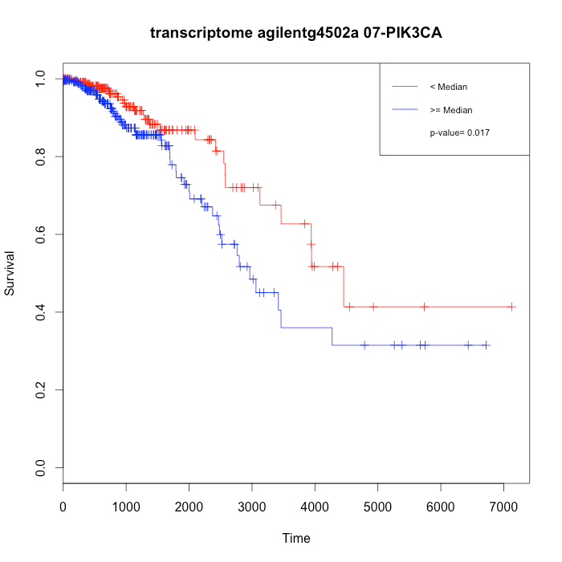

```{r setup, include=FALSE, echo=FALSE}
knitr::opts_chunk$set(eval=FALSE)
```

# Introduction

RTCGAToolbox primarily focuses on data management and download.
We've kept the vignette section where the analysis functions are documented.
Please contact the maintainer on
[GitHub](https://github.com/mksamur/RTCGAToolbox), if you would like to create
a package for the analysis functions and maintain them.

# Post analysis functions
RTCGAToolbox has analyze functions to provide basic information about
datasets. Analyze function includes differential gene expression analyze,
correlation analysis between CN and GE data, univariate survival analysis,
mutation frequency table and report
figure.

* Analysis Functions:
    + getDiffExpressedGenes: This function takes "FirehoseData" object as an
input and uses differential gene expression analysis to compare cancer and
normal samples. Function takes "limma"[3-4] package advantages for performing
analysis. In addition, sample and normal population is obtained from TCGA
sample barcodes.
    + getCNGECorrelation: This function calculates the correlation between
gene expression values and copy number data. Users have to download GISTIC2
[@ref2] copy number estimates, as well as the expression data from at least
one platform.
    + getMutationRate: From all samples that have mutation information, this
function calculates the genes' mutation frequency.
    + getSurvival: Performs an univariate survival comparison for individual
genes between high and low expressed sample groups.
    + getReport: Creates a circular pdf figure from differential gene
expression, copy number and mutation information.


## Differential gene expression
RTCGAToolbox hires voom[@ref4] and limma[@ref3] package functions to preform
differential gene expression analysis between "Normal" and "Cancer" tissue
samples. Every sample which is processed by TCGA project[@ref1] has a
structured barcode number which includes the source of the tissue.
RTCGAToolbox uses the barcode information to divide samples into "Normal" or
"Tumor" groups and perform DGE analysis. Since "voom"[@ref4] requires raw
count for RNASeq data, normalized RNASeq data cannot be used for the analysis.
This function uses all gene expression datasets and returns a list which each
member is "DGEResult" object. Each result object keeps top table from the
genes that have 2 log fold change expression difference and significant
adjusted p value.
This function filters the results as a deafult behaviour using raw p value,
adjusted p value and log fold change. Users can change "adj.pval", "raw.pval"
and "logFC" parameters to refine their results. Also function uses Benjamini &
Hochberg adjustment for p values. For more details about adjment users can
check base adjustment methods by calling "?p.adjust". In addition to filter as
a default behaviour function only draws heatmap for top 100 up and down
regulated genes. Users can also adjust these values by using "hmTopUpN" and
"hmTopDownN" parameters.

```{r}
# Differential gene expression analysis for gene level RNA data.
diffGeneExprs <- getDiffExpressedGenes(dataObject=accmini, DrawPlots=TRUE,
    adj.method="BH", adj.pval=0.05, raw.pval=0.05, logFC=2, hmTopUpN=10,
    hmTopDownN=10)
# Show head for expression outputs
diffGeneExprs
showResults(diffGeneExprs[[1]])
toptableOut <- showResults(diffGeneExprs[[1]])
```
If "DrawPlots" set as FALSE, running code above won't provide any output figure.

Voom + limma: To voom (variance modeling at the observational level) is to
estimate the mean-variance relationship robustly and non-parametrically from
the data. Voom works with log-counts that are normalized for sequence depth,
in particular with log-counts per million (log-cpm). The mean-variance is
fitted to the gene-wise standard deviations of the log-cpm, as a function of
the average log-count. This method incorporates the mean-variance trend into a
precision weight for each individual normalized observation. The normalized
log-counts and associated precision weights can then be entered into the limma
analysis pipeline, or indeed into any statistical pipeline for microarray data
that is precision weight aware[@ref3; @ref4]. Users can check the following
publications for more information about methods:

[limma : Smyth, G. K. (2004). Linear models and empirical Bayes methods for assessing differential expression in microarray experiments. Statistical Applications in Genetics and Molecular Biology, Vol. 3, No. 1, Article 3.](http://www.ncbi.nlm.nih.gov/pubmed/16646809)

[Voom: Law, CW, Chen, Y, Shi, W, Smyth, GK (2014). Voom: precision weights unlock linear model analysis tools for RNA-seq read counts. Genome Biology15, R29.](http://www.ncbi.nlm.nih.gov/pubmed/24485249)

## Correlation between gene expression and copy number data

"getCNGECorrelation" function provides correlation coefficient and adjusted p
value between copy number and gene expression data for each dataset. This
function takes main dataobject as an input (uses gene copy number estimates
from GISTIC2 [@ref2] algorithm and gen expression values from every platform
(RNAseq and arrays) to prepare return lists. List object stores "CorResult"
object that contains results for each comparison.)

```{r}
#Correlation between gene expression values and copy number
corrGECN <- getCNGECorrelation(dataObject=accmini, adj.method="BH",
    adj.pval=0.9, raw.pval=0.05)
corrGECN
```

If the dataset has RNASeq data, data will be normalized for correlation
analysis. Correlation function uses Benjamini & Hochberg adjustment for p
values. For more details about adjment users can check base adjustment methods
by calling "?p.adjust". In addition, to filter results adjusted and raw p
values are used. Users can change "adj.pval" and "raw.pval" parameters to
refine results.

The RTCGAToolbox uses one of Pearson's product moment correlation coefficient
to test for associations between paired samples. Measures of association, all
in the range [-1, 1] with 0 indicating no association, shows how copy number
alterations affect gene expression changes. The test statistic follows a
t-distribution, with length (x)-2 degrees of freedom if the samples follow
independent normal distributions. Users can get detailed information by
calling `?cor.test` function

## Mutation frequencies

"getMutationRate" function gets the data frame that stores mutation frequency
for the genes. This function gets the mutation information for each sample
that has data and calculates frequency for each gene.

```{r}
# Mutation frequencies
mutFrq <- getMutationRate(dataObject=accmini)
head(mutFrq[order(mutFrq[, 2], decreasing=TRUE), ])
```

# Reproducing BRCA results from original manuscript
Following code block is provided to reproduce case study in the RTCGAToolbox
paper[@ref6].

```{r eval=FALSE}
# BRCA data with mRNA (Both array and RNASeq), GISTIC processed copy number data
# mutation data and clinical data
# (Depends on bandwidth this process may take long time)
brcaData <- getFirehoseData (dataset="BRCA", runDate="20140416",
    gistic2Date="20140115", clinic=TRUE, RNAseqGene=TRUE, mRNAArray=TRUE,
    Mutation=TRUE)

# Differential gene expression analysis for gene level RNA data.
# Heatmaps are given below.
diffGeneExprs <- getDiffExpressedGenes(dataObject=brcaData,DrawPlots=TRUE,
    adj.method="BH", adj.pval=0.05, raw.pval=0.05, logFC=2, hmTopUpN=100,
    hmTopDownN=100)
# Show head for expression outputs
diffGeneExprs
showResults(diffGeneExprs[[1]])
toptableOut <- showResults(diffGeneExprs[[1]])

# Correlation between expresiion profiles and copy number data
corrGECN <- getCNGECorrelation(dataObject=brcaData, adj.method="BH",
    adj.pval=0.05, raw.pval=0.05)

corrGECN
showResults(corrGECN[[1]])
corRes <- showResults(corrGECN[[1]])

# Gene mutation frequincies in BRCA dataset
mutFrq <- getMutationRate(dataObject=brcaData)
head(mutFrq[order(mutFrq[,2],decreasing=TRUE),])

# PIK3CA which is one of the most frequently mutated gene in BRCA dataset
# KM plot is given below.
clinicData <- getData(brcaData,"clinical")
head(clinicData)
clinicData <- clinicData[, 3:5]
clinicData[is.na(clinicData[, 3]), 3] <- clinicData[is.na(clinicData[, 3]), 2]
survData <- data.frame(Samples=rownames(clinicData),
    Time=as.numeric(clinicData[, 3]), Censor=as.numeric(clinicData[, 1]))
getSurvival(dataObject=brcaData, geneSymbols=c("PIK3CA"),
    sampleTimeCensor=survData)
```

Differentially expressed genes.</br>

<br/>
KM plot for PIK3CA on BRCA dataset.<br/>


## Report figure
This function provides an overall circle figure for the dataset by using the
RCircos[@ref5]. This function uses differential gene expression analysis
results (max results for 2 different platforms), copy number data estimates
from GISTIC2 [@ref2] and mutation data.

Outer circle shows the gene symbols that have mutation in at least 5% of the
samples. Inner tracks show the significantly altered gene expressions as fold
change and copy number changes where blue represents the deletions and red
represents the amplifications.

This function needs a genes location data frame, which can be obtained from
"hg19.ucsc.gene.locations" data object. Please see the next section.

```{r}
# Creating dataset analysis summary figure with getReport.
# Figure will be saved as PDF file.
library("Homo.sapiens")
locations <- genes(Homo.sapiens, columns="SYMBOL")
locations <- as.data.frame(locations)
locations <- locations[,c(6,1,5,2:3)]
locations <- locations[!is.na(locations[,1]), ]
locations <- locations[!duplicated(locations[,1]), ]
rownames(locations) <- locations[,1]
getReport(dataObject=brcaData, DGEResult1=diffGeneExprs[[1]],
    DGEResult2=diffGeneExprs[[2]], geneLocations=locations)
```
Running code above will provide following circle plot.


## Univariate survival analysis

Survival analysis is considered as one of the methods that can provide
clinically valuable information. To provide this information, the function
creates 2 or 3 groups based on expression data.(If the dataset has RNASeq
data, data will be normalized for survival analysis.). If function is
triggered with 2 groups, RTCGAToolbox creates groups using the median
expression level of individual genes. If group number is set to be 3, then the
groups will be defined as: the samples in 1st. quartile (expression < 1st Q),
the samples those have higher expression (expression > 3rd Q) and the samples
lying in between these 2 groups.

This function also needs a survival data, which can be obtained using clinical
data frame. Clinical data frames can be obtained from main data downloads.
First column of the survival data frame should be sample barcodes, second
column should be time and the last column should be event data. Below code
chunk shows how survival data frame can be obtained from clinical data and how
survival analysis can be done.

```{r fig.width=6,fig.height=6,fig.align='center'}
# Creating survival data frame and running analysis for
# FCGBP which is one of the most frequently mutated gene in the toy data
# Running following code will provide following KM plot.
clinicData <- getData(accmini,"clinical")
head(clinicData)
clinicData <-
    clinicData[, c("vital_status", "days_to_death", "days_to_last_followup")]
missingDays2LF <- is.na(clinicData[["days_to_last_followup"]])
clinicData[missingDays2LF, "days_to_last_followup"] <- clinicData[missingDays2LF, "days_to_death"]
survData <- data.frame(Samples=rownames(clinicData),
    Time=as.numeric(clinicData[, 3]), Censor=as.numeric(clinicData[, 1]))
getSurvival(dataObject=accmini, geneSymbols=c("FCGBP"), sampleTimeCensor=survData)
```

